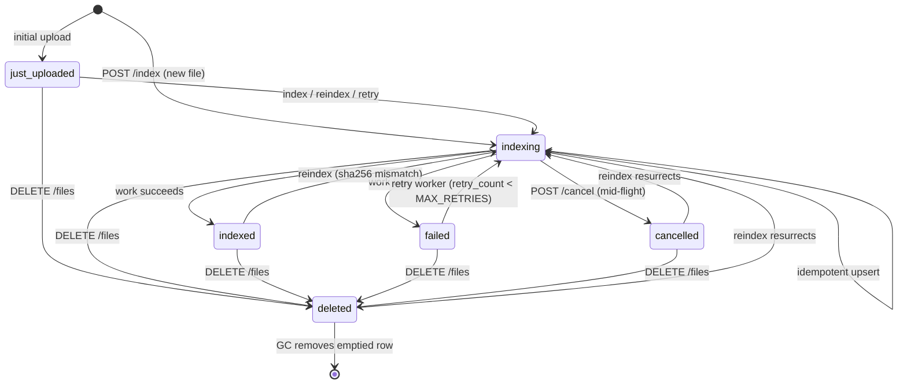

# CLAUDE.md — mindex architecture & conventions

This file captures what is **not obvious from reading the code**: invariants,
conventions, non-trivial "why", gotchas, and regression guards. It deliberately
does **not** mirror the code — no flag tables (`--help`), no per-test lists (read
the tests), no language table (it's the `ProgrammingLanguage` enum + `Cargo.toml`),
no struct/SQL dumps. Deferred work, limitations, and assumptions live in `TODO.md`.

## Overview

`mindex` is an async RAG indexing + search engine in Rust. HTTPS API → `tree-sitter`
AST chunking → `BGE-M3` multi-vector embeddings (dense/sparse/ColBERT) → `Qdrant`
vectors + `SQLite3` metadata. Internal service: TLS is the only transport security,
no API auth.

## Repository layout

```
src/
  main.rs               CLI (clap), startup, migrations, worker spawn, signal handling
  backend/
    http3.rs            RouterState, EmbeddingModel, CancellationGuard, run() (HTTP/1.1+2 today)
    v0/{handlers,models}.rs   post_index/post_search; request/response types, ProgrammingLanguage, UUIDv4, GlobPattern
  db/
    sqlite3.rs          SQLite3Pool, SQLite3PoolError
    qdrant.rs           VectorStore trait (+impl for Qdrant), VectorStoreError, ChunkAsVector, collection_name/collection_for
    files.rs            set_file_status — shared project_files.status transition
    migrations/   v0.1.0_schema.sql (projects, project_files, project_file_chunks);
                  v0.2.0_status_machine.sql (status-transition triggers + project_file_status_log)
  models/bge_m3.rs      BGEm3HttpClient, BGEm3Model trait, EncodeError
  embed.rs              embed_and_upsert — shared embed→upsert pipeline, EmbedUpsertError
  slicing/traits.rs     Slicer, SlicedChunk, SlicerError, Tokenizing trait
  worker/{gc,retry}.rs  GC sweep + status-log prune (hourly), retry of stuck/failed files (60s)
scripts/entrypoint.sh   Docker entrypoint: self-signed cert on first start
tests/                  mock_embedder/ (FastAPI), integration/ (pytest), see Tests
tools/indexer/          mindex-index CLI (own Cargo.toml/lock, not in workspace)
tools/search/           mindex-search.sh (bash) — search frontend (flags + MINDEX_* env)
tools/mcp/mindex/       mindex (Python/Poetry) — MCP stdio server; search + live-index for a coding agent
tools/mcp/scout/        scout (Python/Poetry) — MCP stdio server; token-saving digest (decomposed queries → local-LLM summary)
embedder/               vendored BGE-M3 server (3 heads); host-run + GPU, NOT in the image — see embedder/README.md
Dockerfile, docker-compose{,.test}.yml, rust-toolchain.toml (pins 1.95)
```

## Core invariants (violating these causes bugs)

**Project isolation = collection + has_id filter.** Qdrant uses one collection per
project, `{guid_simple}_v0` (`COLLECTION_SCHEMA_VERSION` in `qdrant.rs`). Always
derive names from `collection_for(project_guid)`; never hardcode. Within a
collection, the candidate set is a `has_id` filter built from SQLite: the search
path queries `qdrant_guid` for chunks matching project + filters + **`status='active'`**
— this is the *sole* isolation mechanism and also excludes soft-deleted vectors.

**Append-only hot path.** Indexing never deletes from Qdrant. On reindex
(sha256 mismatch) old chunks are marked `status='deleted'` in SQLite, new ones
inserted `active`, new vectors upserted; old vectors orphan until the GC worker
removes them. Decouples indexing latency from Qdrant delete latency.

**GC hard-deletes only confirmed rows** (regression guard, `worker/gc.rs`). A sweep
deletes from SQLite *only* chunks whose Qdrant `delete_batch` succeeded; if a
collection's delete fails the rows stay `deleted` for the next sweep. Deleting the
SQLite row before Qdrant confirms would orphan the vector forever (nothing tracks
it). If every collection in a batch fails, the inner loop breaks rather than
spinning. The same pass prunes `project_file_status_log` past `STATUS_LOG_RETENTION`
(30 days) and runs `prune_deleted_files` — drops `deleted` `project_files` rows once
their chunks are gone (chunk→file FK is RESTRICT, so only after the sweep). That
sweep-then-drop ordering is what makes `DELETE /files` eventually physical; `POST /gc`
runs the same pass (`gc::collect`) synchronously. GC is **global** (not per-project),
so a pass is serialized process-wide by a single `Arc<AtomicBool>` flag via `GcGuard`
(`worker/gc.rs`) shared between the handler and the hourly worker: a `POST /gc`
arriving while a pass is already running returns **409**, and the worker **skips its
tick** if a manual pass holds the flag (it retries an hour later). The guard frees the
flag on `Drop`, so a panic/early-return can't wedge GC off.

**Status state machine** (`project_files.status`), enforced by SQLite triggers
(`v0.2.0_status_machine.sql`), not just convention. Legal moves: **any → `indexing`**
(start / reindex / retry), **any → `deleted`** (`DELETE /files`; GC then removes the
emptied row), and **`indexing` → `indexed`|`cancelled`|`failed`** (a terminal is
reachable only from in-progress work); a new row may only enter as
`just_uploaded`/`indexing`. `deleted` is terminal **except** `deleted→indexing`
(re-indexing a path pending deletion resurrects it — the any→`indexing` rule).
Anything else (e.g. `failed→indexed`, `just_uploaded→indexed`) raises
`SQLITE_CONSTRAINT_TRIGGER`. `indexing` is committed durably *before* heavy work
(crash-recoverable; the retry worker picks up files stuck in `indexing` longer than
`--stuck-grace-mins`, default **30 min**). That grace **must exceed the longest
legitimate in-flight request**: cross-file batching holds a whole batch in `indexing`
through the embed pass, so a too-short grace lets the worker race a live batch
(re-embedding its files and tripping illegal transitions). A stuck file with **no
active chunks** (too short → 0 chunks) is marked `indexed`, not `failed` (a wrong
`failed` would trap it, since `failed→indexed` is illegal). `sha256` and the
`retry_count` reset land only on `indexed`. Status writes go through
`db::files::set_file_status` (stamps `status_updated_at`, WARNs on a rejected
transition); every transition is logged to `project_file_status_log` by AFTER-triggers.
A file that exhausts `MAX_RETRIES` (3) stays `failed` and is never retried again
(`worker::retry::warn_permanently_failed` surfaces it at startup and hourly).



Note the missing edges are the point: `failed → indexed` is **illegal** (retry loops back
through `indexing`), and a row may only *enter* at `just_uploaded`/`indexing` — never
straight into a terminal. `POST /cancel` is `indexing → cancelled` (the file row is **not**
deleted). The same diagram lives in the root `README.md`.

**sha256 skip / empty 404.** Re-indexing identical content is skipped by hash.
`post_search` returns 404 immediately when the SQLite candidate set is empty (no
active chunks), without calling Qdrant (avoids a 503 from a missing collection).

**Management endpoints** (`handlers.rs`, routed in `http3::run`, *not* under `/v0`).
`DELETE /projects/{guid}` is an **immediate hard delete** (rows, then drop the
collection last so a retry re-attempts it), idempotent 204. `DELETE
/projects/{guid}/files` is a **soft delete** — its search `include`/`exclude`
selector goes in the **request body** (globs don't fit the path); it marks
files+chunks `deleted` for GC, returns 204 if none matched else 200+count, and
rejects an empty selector (400) so it can't wipe the project. `POST
/projects/{guid}/cancel` is a **best-effort, transactional index-cancel** — same
body selector as the soft delete, same empty-selector 400 — but it matches **only
`status='indexing'`** files (so an already-`indexed`/`failed` file is never touched:
a too-late cancel is a no-op), marks their chunks `deleted` and moves the files
`indexing → cancelled`. It deliberately does **not** take the per-file `IndexClaim`
(so it can interrupt a held one); correctness against a live `/index` rests on two
re-reads, not a lock: `post_index` calls `drop_cancelled` between Phase 1 and Phase 2
(re-reads prepared files' status, drops + chunk-soft-deletes any now-`cancelled` one
before the embed — this also closes the prepare race where cancel lands before the
chunks exist), and the **retry worker re-checks status after acquiring the claim**
(else `cancelled → indexing`, a legal move, would resurrect it). A cancel that lands
mid-embed lets that pass finish; `mark_indexed`'s `cancelled → indexed` is then
trigger-rejected and GC reclaims the orphaned vectors. `GET /projects` (list
all, summary counts), `GET /projects/{guid}` (per-language stats), `POST /gc` (one
synchronous GC pass), `GET /health` (pings SQLite + Qdrant + embedder, reports files
indexing) and `GET /version` round it out.

**FK is RESTRICT.** `project_file_chunks → project_files` is `ON DELETE RESTRICT`.
Never delete a `project_files` row while chunks exist; mark chunks deleted (let GC
clean up), then delete the parent.

## Retrieval pipeline

Collection has three named vectors: `dense` (1024-d cosine), `sparse` (SPLADE-style),
`colbert` (1024-d cosine, multivector MaxSim). Search: prefetch top-200 dense +
top-200 sparse → RRF fusion → ColBERT MaxSim rerank → top-k. `post_search` runs
**two** SQLite queries around Qdrant — first the candidate `qdrant_guid`s for the
`has_id` set, then `code`/metadata for *only* the top-k winners — never loading
`code` for the whole active set (don't collapse these back into one query). It then
**sorts results by score descending** before responding (don't rely on Qdrant's
return order). Sparse weights `≤ 1e-5`
are dropped before upsert. Batch sizes: `--embed-batch` chunks per `/encode` call
(default 256 — the GPU-load lever, paired with the embedder's own `--batch`), 256
points per Qdrant upsert/delete (`embed.rs`). Embed-response vector lists are
positionally aligned with the chunk list.

The embedder client (`bge_m3.rs::BGEm3HttpClient`) retries HTTP **429** (embedder
busy/backpressure) up to 3× with exponential backoff (200/400/800ms), respecting
the cancellation token during sleeps; if it's still 429, it gives up — the file is
marked `failed` and the retry worker re-attempts later (layered backoff).

## Slicer

`Slicer` (`slicing/traits.rs`) walks the tree-sitter AST depth-first and selects
**named nodes** whose token span (HF tokenizer) is **128–512 tokens** — BGE-M3's
sweet spot. Token boundaries don't align with AST nodes and tokenization is
context-dependent, so the window is measured, not computed. `code` is extended
left to the node's line start *only* when the intervening bytes are pure indentation
(mid-line nodes are not extended). `SlicedChunk.start_byte/end_byte` are
`#[cfg(test)]`-gated — used only by the slicer's own byte-alignment tests, never
persisted — so they don't trip `dead_code` in non-test builds.

## Concurrency & cancellation

- **Async-first.** All I/O is async. SQLite runs in `spawn_blocking` via
  `db_pool.transaction()`; Qdrant/embed are `.await`-ed directly in handlers — no
  `block_on`.
- Every long loop / I/O respects a `tokio_util` `CancellationToken`. Client-cancelled
  requests return HTTP 499 (`cancelled_499()`, nginx convention).
- **How cancellation actually propagates (subtle).** A handler's `CancellationGuard`
  wraps a *fresh* token, cancelled only by its own `Drop`. On client disconnect
  axum drops the handler future → `Drop` fires `cancel()`, but the future is gone,
  so the in-handler `Cancelled` cleanup arms are **defensive, rarely hit**. The
  token's real job is letting in-flight `spawn_blocking` (slicer) and the embed
  `select!` bail early after the future is abandoned; the half-written DB row is
  recovered later by the retry worker. (Clean shutdown uses a *separate* token tree
  rooted in `main.rs`.)
- **Connection-return is cancellation-safe** (regression guard, `sqlite3.rs`). The
  blocking task pushes its connection back into the pool *itself*
  (`conns.blocking_lock().push`), not the awaiting code after `handle.await`.
  Dropping a `spawn_blocking` JoinHandle does **not** cancel the task, but if release
  depended on the awaiting future, a future dropped mid-transaction would leak the
  connection — after `db_pool_size` (4) such events the pool is permanently empty
  (`PoolEmpty` forever). A closure panic is the one case the conn isn't returned
  (logged on `JoinError`).

## SQLite pool

Fixed-size pool of `rusqlite::Connection` behind a `tokio::sync::Mutex<Vec<_>>`
(acquire = pop, return = push). Per-connection PRAGMAs at startup: WAL,
`foreign_keys=ON`, `synchronous=NORMAL`, 16 KB pages. Handlers run **multiple
sequential `transaction()` calls** (one per logical step), not one giant
transaction — so the soft-delete pattern keeps state recoverable if a later step
fails.

## post_index shape

`post_index` runs a `FileIndexer` in **two phases** so the GPU sees big batches
(not one file's chunks at a time):
1. **`prepare` every file** — hash-check (`Ok(None)` = unchanged, skipped) → set
   `indexing` → main tx (mark old chunks deleted + slice + insert) → returns a
   `Prepared` carrying that file's chunks. Each runs in its own `indexing_file`
   span (no `Entered` guard across `.await`).
2. **`embed_all`** the chunks from *all* prepared files in one batched pass
   (`embed::embed_and_upsert`, `--embed-batch` chunks per `/encode`).
3. **`mark_indexed`** each file + tally the response.

Recovery is per-batch: if any `prepare` or the shared embed fails, every
already-prepared file (still `indexing`, chunks inserted) is recovered to
`failed`/`cancelled` via `recover_all` and the retry worker re-embeds them later.
`tree_sitter::Parser` is `Send`, so the slicer is built inside the `spawn_blocking`
closure. The `/index` request body limit is `--max-body-mb` (default 256 MiB) via
`DefaultBodyLimit` — axum's 2 MB default is far too small for multi-file posts.

## Mockable interfaces

Three traits let handlers/workers be unit-tested without live infra; the production
type is the only real impl, fakes live in `#[cfg(test)]`:
- **`BGEm3Model`** (`models/bge_m3.rs`) — embedder; held as `Arc<dyn BGEm3Model>` in
  `RouterState`/`EmbeddingModel` and the retry worker.
- **`VectorStore`** (`db/qdrant.rs`) — all Qdrant ops; impl'd for `Qdrant`, shared as
  `Arc<dyn VectorStore>`. Error is `VectorStoreError` (rendered string, not the
  unconstructible `QdrantError`) so fakes can simulate failures.
- **`Tokenizing`** (`slicing/traits.rs`) — the slicer's only tokenizer need
  (`token_offsets`); impl'd for `tokenizers::Tokenizer`; fakes avoid the HF download.

New seam = minimal trait + production type as sole impl + owned error if the real
one isn't test-constructible. `SQLite3Pool` is intentionally **not** a trait (its
generic-closure `transaction` isn't object-safe) — test DB code against a real
`:memory:` pool.

## Error handling & logging

- Domain errors (`SQLite3PoolError`, `SlicerError`, `EncodeError`, `VectorStoreError`,
  `EmbedUpsertError`) are convertible to HTTP statuses. No external error crates;
  follow `slicer_err_to_pool_err` / `from_cancelled`. `from_cancelled` maps the
  `None` from `with_cancellation_token` (timeout/cancel) to `Cancelled`.
- No `unwrap`/`expect` in production paths (workers use `unwrap_or_default` for
  best-effort queries). Startup-only panics (`SQLite3Pool::new`) use
  `unwrap_or_else(|e| panic!(...))` naming the file and what to check.
- **Logging shape (uniform):** a mandatory message stating *what operation failed*
  (never bare `error!(?err)`); the error as a field `error = ?e`/`%e` (not
  interpolated); identifiers as fields (`%` for String/Uuid, `?` for enums).
  Handlers carry `project_guid`/`pl`/`path` on the span; workers (no span) pass
  them explicitly. Infra failures end with a one-line sysadmin hint (model-server
  reachability + the `0.0.0.0` vs `127.0.0.1` gotcha, Qdrant reachability, DB
  writability); logic errors don't.

## Performance conventions (hot paths)

Build `ChunkAsVector` by **moving** the per-batch `dense_vecs`/`colbert_vecs`
(`into_iter`), not cloning; split the sparse `HashMap` into parallel index/value
arrays in a **single pass** with the `>1e-5` threshold applied once. Lives in
`embed.rs` (shared by `post_index` and the retry worker).

## Languages

The supported set *is* the `ProgrammingLanguage` enum (`models.rs`) + the matching
crates in `Cargo.toml`; the extension→language map is `tools/indexer/src/scanner.rs`.
Hard constraint: every grammar crate must depend on `tree-sitter ≥ 0.23` (the
`LanguageFn`/`LANGUAGE` API) — older crates depend on full `tree-sitter` at an old
version and cause a native `links` conflict. Verify with `cargo info` + the source
in `~/.cargo/registry/src/` before adding. (Languages still blocked on upstream are
in `TODO.md`.)

**Adding a language touches all of these** — each omission fails differently (422 →
SQLite CHECK 500 → silently skipped file), so do the whole list:
1. `ProgrammingLanguage` enum + `ToSql`/`FromSql` (`models.rs`), lowercase serde name.
2. `CHECK` constraint in `v0.1.0_schema.sql`.
3. `tree-sitter-<lang>` in `Cargo.toml` (verify ≥ 0.23).
4. Arm in `tree_sitter_language(pl)` (`handlers.rs`) — total match, missing arm = compile error.
5. `detect_language` + `Language::name()` in `scanner.rs` (else the indexer silently skips the file).
6. `VALID_LANGS` + `ext_to_lexer()` in `tools/search/mindex-search.sh`.
7. Rebuild the image (`docker compose build mindex`) and, since the `CHECK` changed,
   drop the DB volume (`docker compose down && docker volume rm mindex_mindex_db && up -d`)
   — `CREATE TABLE IF NOT EXISTS` won't alter an existing table.

## Tooling (`tools/`)

Both CLIs document themselves via `--help`; only the non-obvious bits here.

- **`tools/indexer/` (`mindex-index`)** — walks a tree, uploads files. Detects
  language by extension and groups automatically, so one invocation with several
  `--include` globs covers multiple languages. **Always `--exclude 'tools/**'` when
  indexing mindex itself** (the CLIs' `long_about` text pollutes results).
  `chunk_count == 0` in the response means "sliced to no chunks" (below 128 tokens),
  *not* unchanged — hash-unchanged files are skipped server-side and absent entirely.
- **`tools/search/mindex-search.sh` (bash)** — the single search frontend. POSTs search,
  renders with `pygmentize` if present (else plain). Results print **ascending by
  score** so the best match is last, right above the prompt. Every API status is
  handled distinctly (404 = no match, not an error; 499/503/500 mapped; curl
  transport failure reported separately). The query comes from `--query`, then
  `$EDITOR` (`--edit`), then stdin. Every option has a `MINDEX_*` env-var fallback
  (so it can run fully env-driven, e.g. an alias or CI job); an explicit flag wins
  over its variable. (The old `mindex-search-edit` POSIX-sh wrapper was folded in.)
- **`tools/mcp/mindex/` (`mindex`, Python/Poetry)** — MCP stdio server (sibling of the
  CLIs; hits the same HTTP API). The **intended primary way an agent drives mindex**:
  `search` for precise code to read or edit (top-5 cap fixed in the adapter — the
  model can't raise it), `index_files`/`delete_files` to keep the index live as it
  edits.
  Live reindex is meant to be called freely — unchanged files are hash-skipped
  server-side — but `index_files` carries full bodies, so it is **only** for the few
  files just touched, passed **verbatim**; a *bulk* (re)index or path-exclude job goes
  through `mindex-index`, not a loop of `index_files`. Reads the project GUID from a
  repo-root `.mindex` file (gitignored). No network at handshake (connects even with
  mindex down). `search` takes optional `include`/`exclude` filters
  (`{paths, programming_languages}`) passed straight through to `/search` — the only
  filtered MCP path (the tools otherwise expose just GUID+query); the backend already
  supported them, the adapter just plumbs them. See `tools/mcp/mindex/README.md`.
- **`tools/mcp/scout/` (`scout`, Python/Poetry)** — second MCP server, a
  **token-economy** layer in front of the same `/search` API: the agent sends 2-4
  decomposed sub-queries, a local LLM (Ollama, default `qwen2.5:14b`) reads the
  matching chunks and returns only a compact summary + `[path:start-end]` pointers,
  so raw code never enters the agent's context (roughly an order-of-magnitude context
  saving on a survey). It's the **cheap-breadth half** (server `scout`, tool `digest`);
  `mindex`'s raw `search` is the **paid-precision half** — orient with `digest`, then
  follow its pointers with `search` for exact code. Recall is governed by
  `DIGEST_MAX_CHUNKS`/`DIGEST_NUM_CTX`, which **must move together**: too small a
  `num_ctx` silently truncates the digester's prompt and drops the lowest-scored
  long-tail chunks. `digest` also takes optional `include`/`exclude` (same shape as
  `search`), applied to every sub-query. mindex is untouched and the layer is fully
  removable. See `tools/mcp/scout/README.md`.

The `.mindex` file (repo-root, gitignored) is **GUID on the first non-comment line**;
optional `exclude_paths:` / `include_paths:` / `languages:` lines below it carry
project-standing search scope that the `digest` agent reads and passes as the
`include`/`exclude` filters above (the MCP servers themselves don't parse `.mindex` —
they take the GUID + filters as call args).

## Docker & CI

- Toolchain pinned to 1.95 (`rust-toolchain.toml`); `libsqlite3-sys 0.38` needs
  ≥1.87, `icu_collections 2.2` needs ≥1.86. `cargo-chef` is **not** used (needed
  1.88+ and conflicted) — layer caching is `cargo fetch --locked` over a stub
  `src/main.rs`, so only `src/` changes trigger recompiles. Legacy builder (no
  BuildKit) supported; no `--mount=type=cache`.
- `entrypoint.sh` generates a self-signed RSA-4096 cert into the `mindex_certs`
  volume on first start.
- **Prod compose** (`docker-compose.yml`): `qdrant` + `mindex`;
  `extra_hosts: host.docker.internal:host-gateway` lets the container reach a
  host-run embedder. The embedder source is vendored in `embedder/` but is
  deliberately *not* built or composed here — its heavy GPU deps (~8 GB torch) keep
  it on the host; it's a temporary wrapper until an off-the-shelf server emits all
  three BGE-M3 heads.
- **Test compose** (`docker-compose.test.yml`, doesn't extend base): qdrant +
  mock-embedder + mindex + test-runner. Run:
  `docker compose -f docker-compose.test.yml up --build --exit-code-from test-runner --abort-on-container-exit`.
  Healthchecks use `/dev/tcp` (qdrant) and `urllib` (embedder) because neither image
  has curl. `mindex` has no host port; test-runner reaches it on the internal net.

## Tests

- **Unit** (`cargo test --bin mindex`): slicer (incl. a fake-`Tokenizing` test, no
  HF download), `build_search_query` SQL/param numbering, `embed_and_upsert` via fake
  `BGEm3Model` + fake `VectorStore`, SQLite pool (incl. the connection-leak
  regression), GC sweep (incl. the orphan-prevention regression via a `FakeStore`).
  No server/Docker; some slicer tests need the BGE-M3 tokenizer from the HF cache.
- **Integration** (`tests/integration/`, pytest in Docker): mock embedder returns
  deterministic vectors seeded by text hash (stable ranking assertions). `test_e2e.py`
  is the rust happy path; `test_filters_and_languages.py` covers non-rust languages
  and include/exclude (language + path-GLOB) filters; `test_management.py` covers the
  stats / delete-project / delete-files / GC endpoints (each deletion test calls
  `POST /gc` to confirm physical removal). Fresh project GUID per test.

## Linting (zero warnings everywhere — non-default flags matter)

- Rust: `cargo clippy --bin mindex` and `cd tools/indexer && cargo clippy`.
- Shell: `shellcheck scripts/entrypoint.sh`, `shellcheck --shell=bash tools/search/mindex-search.sh`;
  format with `shfmt -i 4 -ci` (4-space + indented case — bare `shfmt` defaults to tabs).
- Python (`tests/`): `ruff check`, `ruff format --check` **and** `black --check`
  (kept compatible — avoid the long `assert cond, "msg"` they format differently),
  `mypy` (`fastapi` is `# type: ignore` — its stubs live only in the mock's image).
- SQL: `sqlfluff lint src/db/migrations/` — dialect + relaxed layout rules come
  from repo-root `.sqlfluff` (schema is intentionally column-aligned).
- On intentional code, prefer a scoped `#[allow(...)]`/config exclusion **with a
  reason** over contorting code (see `OptionResultExt::from_cancelled`,
  `qdrant::VectorStore::search`, `.sqlfluff`). Never project-wide suppression.

## When modifying code

1. New loops touching Qdrant/SQLite/model-server must respect the `CancellationToken`.
2. Multi-row DB writes go inside a `transaction`.
3. New endpoints register in `backend::http3::run`, use `RouterState`, `{param}` route syntax, `#[debug_handler]`.
4. Reach Qdrant only via `VectorStore`; derive collection names from `collection_for`.
5. Any search path's SQLite query must include `AND c.status = 'active'`.
6. Status writes use `set_file_status` (stamps `status_updated_at`) and must be a
   legal transition (triggers enforce it — see the state machine). New
   status-changing paths need a transition test.
7. Adding a language → the full checklist under **Languages**.
8. Schema change → new migration file in the `MIGRATIONS` slice; the DB is
   droppable (no upgrade path).
