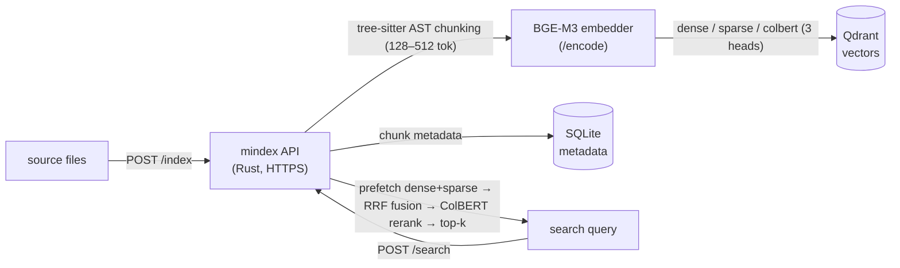
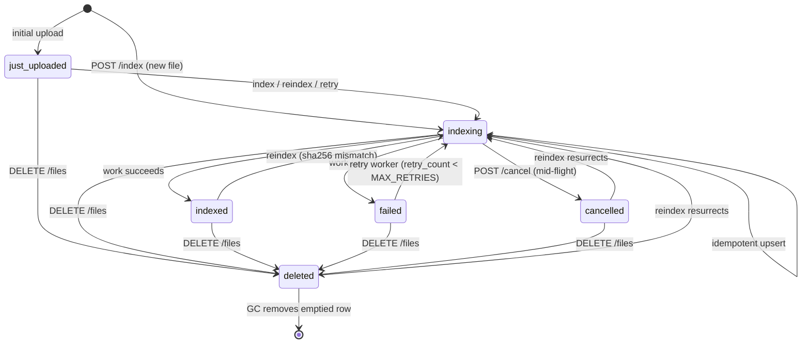

# MINDex — a *mindful* index

A local-first semantic code search engine built around **[BAAI/bge-m3](https://huggingface.co/BAAI/bge-m3)**.

mindex is purpose-built for BGE-M3 and uses **all three of its heads as-is** — dense
embeddings, SPLADE-style sparse lexical weights, and ColBERT multi-vectors — to do
true hybrid retrieval (RRF fusion + ColBERT reranking) over your codebase.

**Its primary, first-class mode is as a coding agent's code-search tool over [MCP](https://modelcontextprotocol.io).**
The point is to let an agent like **Claude Code understand a codebase cheaply**: it
queries the index and gets back the handful of chunks that actually matter, instead of
reading whole files into its context window and burning tokens. Semantic search becomes
the agent's default way to navigate the repo, and keeping the index live (reindex on
edit) is a deliberately cheap, routine operation. This is the intended way to run
mindex — not an add-on. **Setup: [`tools/mcp/mindex/README.md`](tools/mcp/mindex/README.md).** The
same engine also drives a plain terminal search frontend (`mindex-search.sh`) for
humans.

## Highlights

- **Agent-native (MCP), by design.** The headline use case: a coding agent (Claude Code)
  searches your codebase over MCP and reads only the chunks that matter — cutting token
  and context cost. Keeping the index live as the agent edits is intentionally cheap.
  See [`tools/mcp/mindex/README.md`](tools/mcp/mindex/README.md).
- **Three-head hybrid retrieval, no compromise.** Dense + sparse + ColBERT are combined
  exactly as BGE-M3 produces them — not just cosine over dense vectors.
- **Your code never leaves your machine.** Vectors live in a local Qdrant, metadata in
  a local SQLite file. Nothing is sent to a third party.
- **Cheap to run.** BGE-M3 is light: inference is near-instant even on CPU. The embedder
  fits comfortably on a modest GPU (~4–6 GB VRAM) and runs CPU-only if you have none.
- **Fast indexing of large codebases.** AST-aware chunking (tree-sitter) + batched,
  concurrent uploads. *(Concrete benchmarks are still TODO.)*
- **21 languages** out of the box (Rust, Python, TS/JS, Go, C/C++, Java, C#, SQL, …).

## How it works



Indexing is append-only; reindexed/deleted chunks are soft-deleted and swept by a
background GC. Project isolation is one Qdrant collection per project plus a SQLite-built
`has_id` filter.

### File status state machine

Each indexed file has a `status` in SQLite, guarded by triggers (not just convention):
a row may only **enter** as `just_uploaded` or `indexing`; from there the only legal moves
are `any → indexing` (start / reindex / retry), `any → deleted` (soft delete, then GC),
and `indexing → {indexed | cancelled | failed}` (a terminal is reachable only from
in-flight work). Anything else (e.g. `failed → indexed`, `just_uploaded → indexed`) is
rejected. Retry therefore loops back through `indexing`, never straight to `indexed`.



`POST /cancel` moves matched in-flight files `indexing → cancelled` (it does **not** delete
the file row); a file that exhausts `MAX_RETRIES` stays `failed` and is never retried again.
`deleted` is terminal except for `deleted → indexing` (re-indexing a path pending deletion
resurrects it).

## Components

| Piece | What it is |
|-------|-----------|
| **mindex** (`src/`) | The Rust async HTTPS server — the API below. |
| **embedder** (`embedder/`) | The BGE-M3 model server exposing all three heads over `/encode` + `/health`. Runs on the host (GPU) or in the cloud — see below. |
| **mindex-index** (`tools/indexer/`) | CLI that walks a directory tree and uploads files for indexing (`--concurrency`, glob include/exclude, live progress). |
| **mindex-search.sh** (`tools/search/`) | Terminal search frontend: a query in, syntax-highlighted matches out. Configurable by flags or `MINDEX_*` env vars. |
| **mindex** (`tools/mcp/mindex/`) | MCP stdio server exposing mindex search (+ live-index maintenance) to a coding agent like Claude Code — **the intended way to drive mindex from an agent.** See [`tools/mcp/mindex/README.md`](tools/mcp/mindex/README.md). |
| **scout** (`tools/mcp/scout/`) | Second MCP server: a **token-saving** layer over the same search API. The agent sends a few decomposed sub-queries, a local LLM reads the chunks and returns only a compact summary + `file:line` pointers, so raw code never enters the agent's context — roughly an order-of-magnitude less context than raw search on a survey. Orient with its `digest` tool, then follow its pointers with raw `search` for exact code. See [`tools/mcp/scout/README.md`](tools/mcp/scout/README.md). |

## Install (native CLI)

To get the host commands on your `PATH` instead of running them from the build tree,
install them with `cargo install` (the idiomatic Rust route — no sudo). They land in
`~/.cargo/bin`, so make sure that's on your `PATH` (`export PATH="$HOME/.cargo/bin:$PATH"`
in your shell rc — on a default rustup setup it often isn't):

```sh
cargo install --locked --path .             # mindex (server)
cargo install --locked --path tools/indexer # mindex-index (separate crate)
ln -sf "$PWD/tools/search/mindex-search.sh" ~/.cargo/bin/mindex-search
```

Re-run the `cargo install` lines (add `--force`) after pulling changes to rebuild in
place. **Prereqs:** rustup (the pinned 1.95 toolchain auto-installs from
`rust-toolchain.toml`) plus the usual native build deps (`cc`/`clang`, `cmake`,
`protoc`, `pkg-config`); `mindex-search` needs `jq`, and `pygmentize`
(`python-pygments`) is optional for syntax-highlighted output.

> The native **`mindex` server** binary still needs its runtime to actually *run* — TLS
> cert/key paths, the XDG `mindex/config.toml`, and a reachable Qdrant + embedder. The
> canonical deployment stays docker-compose (below); the native binary is handy for
> `mindex --help`, `--version`, and ad-hoc runs.

## Running

**The shape of it.** Three services and two host-side CLI tools. The dependency order
is bottom-up: **Qdrant** (vectors) and the **embedder** (BGE-M3) come up first; the
**mindex server** connects to both and serves the HTTPS API; then the **`mindex-index`**
and **`mindex-search.sh`** tools — which run on your machine — drive that API over HTTPS.
So you start the two backends, start mindex pointed at them, then build the tools once and
use them. `docker-compose.yml` wires Qdrant + mindex together and is the **canonical
reference for the server's flags** — read it for the exact values; treat it as an
illustration, not a prescription (you don't have to run mindex this way).

**1 — Start the embedder** (it is *not* in any image: torch alone is ~8 GB and it needs
direct GPU access, so it runs separately):

```sh
cd embedder
uv sync                                           # then supply torch — see embedder/README.md
uv run python -m bge_m3_api --port 11211          # binds 0.0.0.0; ~4–6 GB VRAM, or CPU
```

> **No local GPU?** The embedder is a standalone HTTP service, so a natural use case is to
> deploy it to a cloud GPU and point mindex at it via `--model-server`. *(A deployment
> template for this is TODO.)*

**2 — Start Qdrant + mindex.** The compose file brings up Qdrant and the mindex server
(reaching the host embedder via `host.docker.internal:11211`):

```sh
docker compose up -d --build
```

mindex listens on `https://localhost:11111` (a self-signed cert is generated on first
start; mount real certs at `/certs` to override).

**3 — Build the host tools** (once). The indexer is a small Rust crate; the search tool
is a shell script needing `curl` + `jq` (plus `pygmentize` for color):

```sh
( cd tools/indexer && cargo build --release )   # → tools/indexer/target/release/mindex-index
```

**4 — Index a codebase:**

```sh
PROJECT=$(uuidgen | tr -d -)
tools/indexer/target/release/mindex-index \
    --project "$PROJECT" --root /path/to/repo --no-verify \
    --include 'src/**/*.rs' --exclude '**/target/**'
```

**5 — Search:**

```sh
echo 'where do we validate the auth token?' \
    | MINDEX_PROJECT="$PROJECT" tools/search/mindex-search.sh --no-verify
# or open $EDITOR for a multi-line query:
MINDEX_PROJECT="$PROJECT" tools/search/mindex-search.sh --no-verify --edit
```

**6 — Wire it into a coding agent (the intended mode).** Save the project GUID in a
`.mindex` file at the repo root and register the MCP server, so an agent (e.g. Claude
Code) searches the index itself — reading only the chunks that matter — and keeps it
live as it edits. Full setup in **[`tools/mcp/mindex/README.md`](tools/mcp/mindex/README.md)**.

## HTTP API

All endpoints are HTTPS. TLS is the only transport security — there is **no API auth**
(mindex is meant for a trusted local network).

Interactive, always-current docs for every endpoint below (request/response schemas,
status codes, behavior and concurrency notes, grouped by Indexing / Search / Projects /
Garbage Collection / Observability / Config) are served as **Swagger UI at
`https://localhost:11111/swagger-ui`**; the raw OpenAPI spec is at
`/api-docs/openapi.json`.

| Method & path | Purpose |
|---------------|---------|
| `POST /v0/{project}/index` | Index/reindex files (JSON: `{files: {lang: {path: {code}}}}`). |
| `POST /v0/{project}/search` | Hybrid search; returns top-k chunks with scores. |
| `GET /projects` | List all projects with summary counts. |
| `GET /projects/{project}` | Stats: files by status, chunks per language. |
| `GET /projects/{project}/files` | Per-file listing (status, language, hash, active-chunk count, retry count); optional `?status=` / `?language=` filters. `?status=failed` is the dead-letter view. |
| `DELETE /projects/{project}` | Hard-delete a project (rows + Qdrant collection). |
| `DELETE /projects/{project}/files` | Soft-delete files by an include/exclude selector (body). |
| `POST /projects/{project}/cancel` | Best-effort cancel of in-flight indexing for files matching an include/exclude selector (body); only `indexing` files are affected. |
| `POST /projects/{project}/retry` | Requeue `failed` files for the retry worker (resets `retry_count`); optional include/exclude selector (body) — empty body = all failed files. |
| `POST /gc` | Run garbage collection synchronously. |
| `GET /status` | Live runtime state: held indexing claims, GC running flag, SQLite pool headroom, file counts by status. |
| `GET /config` | Static capabilities and tuning knobs: version, model, supported languages, batch/pool/retry settings. |
| `GET /health` | Readiness: pings SQLite + Qdrant + the embedder, reports files currently indexing. |
| `GET /version` | Running mindex version. |

## Key configuration

mindex is configured in two layers: a **TOML config file** (base values) plus **CLI
flags** that override it. Precedence is `flag > file > built-in default`. The file is
found by XDG convention — `--config <path>` / `$MINDEX_CONFIG`, then
`$XDG_CONFIG_HOME/mindex/config.toml` (i.e. `~/.config/mindex/config.toml`), then
`$XDG_CONFIG_DIRS/*/mindex/config.toml`. A missing file is fine (defaults are used). At
startup mindex logs which paths it checked, the file it loaded, and every value a flag
overrode; an invalid config aborts startup with an explanation. See
[`config.example.toml`](config.example.toml) for every key (each carries its unit, e.g.
`embed_batch_chunks`, `gc_interval_seconds`, `health_timeout_ms`) and its default.

Common flags (see `mindex --help` for the full set; `docker-compose.yml` for defaults in
context):

- `--config` — path to a TOML config file (overrides XDG discovery).
- `--bind` — listen address (default `127.0.0.1:11111`).
- `--model-server` — embedder URL (default `http://localhost:11211`).
- `--qdrant-server` — Qdrant gRPC URL (default `http://localhost:6334`).
- `--db-path` — SQLite metadata file.
- `--embed-batch` — chunks per `/encode` call (GPU-load lever; match the embedder's `--batch`).

The `mindex-index` CLI follows the same scheme (`~/.config/mindex/indexer.toml`; see
[`tools/indexer/indexer.example.toml`](tools/indexer/indexer.example.toml)).

## Why a custom embedder?

General-purpose model servers (vLLM, Ollama, …) return **only dense** embeddings — none
expose BGE-M3's sparse lexical weights and ColBERT token vectors together, which the
hybrid pipeline needs. `embedder/` exists **solely** to bridge that gap and is intended
to be **removed** once an off-the-shelf server emits all three heads.

It is **tuned for indexing throughput**, not just correctness: `/encode` replies over a
compact **binary protocol** (not JSON — ColBERT is a 1024-d-per-token multivector, so a
JSON body ran to hundreds of MB and serialization dominated each request), and it calls
BGE-M3's three-head GPU forward **directly, once per batch**, bypassing FlagEmbedding's
discard-and-retry double forward. Together these multiplied indexing throughput several
times over; see [`embedder/README.md`](embedder/README.md) and
[`perf/README.md`](perf/README.md) for the full investigation.

## Status & roadmap

Early but functional. Tracked deferrals live in [`TODO.md`](TODO.md); the headline ones:

- **Performance benchmarks** for large-codebase indexing — not measured yet.
- **A cloud-GPU deployment template** for the embedder.
- A few accepted limitations (no API auth, single embedding model at a time, the
  `has_id` filter's linear growth on very large projects).

## References

- **BGE-M3** — [BAAI/bge-m3 on Hugging Face](https://huggingface.co/BAAI/bge-m3)
- **Qdrant** — vector store ([qdrant.tech](https://qdrant.tech))
- **tree-sitter** — AST parsing for chunking ([tree-sitter.github.io](https://tree-sitter.github.io))
