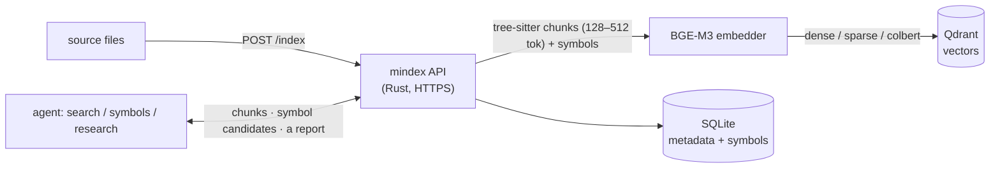

# MINDex — a *mindful* index

**A coding agent should not read your codebase. It should ask.**

mindex is a local-first code index built for exactly one economics problem: a frontier
model's context is the expensive resource, and reading files burns it. So mindex sells
three things, all of them local and all of them cheap:

- **Search that costs a few chunks, not a few files.** Hybrid retrieval on
  [BGE-M3](https://huggingface.co/BAAI/bge-m3) using **all three heads as-is** — dense +
  SPLADE-style sparse + ColBERT multivectors, RRF-fused and reranked. The agent gets the
  handful of chunks that matter.
- **Exact answers to "where is X defined / who calls X".** A tree-sitter symbol table,
  built at index time, replaces the grep loops that used to eat context.
- **Research at zero token cost.** Ask a question; a **local** model runs the whole
  investigation — many searches, symbol lookups, reading code — and hands back a cited
  Markdown report. The code it read never enters your model's context. You pay
  wall-clock time on your own hardware, and nothing else.

Your code never leaves the machine: vectors in a local Qdrant, metadata in a local
SQLite file. 21 programming languages plus Markdown. BGE-M3 is light — ~4–6 GB VRAM,
or CPU-only.

**The intended way to run it is as an agent's tool over [MCP](https://modelcontextprotocol.io)**
→ [`tools/mcp/mindex`](tools/mcp/mindex/README.md) (search, symbols, live reindex) and
[`tools/mcp/scout`](tools/mcp/scout/README.md) (research). A terminal frontend and a
[VS Code extension](tools/vscode/README.md) drive the same API for humans — the
extension ships as a `.vsix` on the
[releases page](https://github.com/silencespeakstruth/mindex/releases), so
`code --install-extension mindex-vscode-1.0.1.vsix` is the whole of installing it.


```mermaid
flowchart LR
    src["source files"]
    api["mindex API<br/>(Rust, HTTPS)"]
    emb["BGE-M3 embedder"]
    qd[("Qdrant<br/>vectors")]
    db[("SQLite<br/>metadata + symbols")]
    ask["agent: search / symbols / research"]

    src -->|"POST /index"| api
    api -->|"tree-sitter chunks (128–512 tok) + symbols"| emb
    emb -->|"dense / sparse / colbert"| qd
    api --> db
    ask <-->|"chunks · symbol candidates · a report"| api
```

## Install

```sh
cargo install --locked --path .              # mindex (server)
cargo install --locked --path tools/indexer  # mindex-index
cargo install --locked --path tools/watcher  # mindex-watch (optional daemon)
ln -sf "$PWD/tools/search/mindex-search.sh" ~/.cargo/bin/mindex-search
```

`~/.cargo/bin` must be on `PATH`. Needs rustup (toolchain auto-installs from
`rust-toolchain.toml`) and the usual native build deps (`cc`/`clang`, `cmake`, `protoc`,
`pkg-config`); `mindex-search` also wants `jq` and, optionally, `pygmentize`.

**Platforms.** Developed and run on Linux, and the shell snippets below assume it. The
server, `mindex-index` and `mindex-watch` are portable Rust and build wherever rustup
and those native deps do; the VS Code extension and both MCP servers are
platform-agnostic. Two Linux-shaped things to know if you are elsewhere:
`tools/search/mindex-search.sh` is bash and has no Windows equivalent — use the
extension or an MCP client instead — and config discovery follows the XDG spec via
`$XDG_CONFIG_HOME`/`$HOME`, which Windows does not set, so name the file explicitly
there with `--config` or `$MINDEX_CONFIG`.

## Run

Bottom-up: embedder → Qdrant → mindex.

```sh
# 1. Embedder — never in a container (torch is ~8 GB and wants the GPU directly).
cd embedder && uv sync && uv run python -m bge_m3_api --port 11211

# 2. Qdrant + mindex. No host ports by default; add the overlay to reach the API
#    from the host (both loopback-only).
docker compose -f docker-compose.yml -f docker-compose.exposed.yml up -d --build

# 3. Index a repo. .mindex at the repo root is the project id and its scope.
printf 'guid: %s\nexclude_paths:\n  - target/**\n' "$(uuidgen)" > .mindex
mindex-index --root . --no-verify

# 4. Ask.
echo 'where is the auth token validated?' | \
    MINDEX_PROJECT="$(mindex-index --print-guid)" mindex-search --no-verify
```

For research, mindex also needs a local [Ollama](https://ollama.com) with a model pulled
(a thinking model works best). Then wire it into your agent — that is the point:
**[`tools/mcp/mindex`](tools/mcp/mindex/README.md)** and
**[`tools/mcp/scout`](tools/mcp/scout/README.md)**.

## Typical configuration

`~/.config/mindex/config.toml` (XDG-discovered; CLI flags override it; every key is
optional — see [`config.example.toml`](config.example.toml) for the full set). Paths
are absolute; substitute your own:

```toml
[server]
cert_path = "/path/to/config/cert.pem"            # TLS is the only transport security
key_path  = "/path/to/config/key.pem"

[model]
server_url = "http://localhost:11211"             # the BGE-M3 embedder

[qdrant]
server_url = "http://localhost:6334"

[database]
path = "/path/to/data/mindex.db"                  # keep it out of the repo

[research]
ollama_url = "http://127.0.0.1:11434"
default_model = "glm-4.7-flash:latest"            # any local model
max_concurrent = 2                                # research runs on its own small pool
```

### `.mindex`

`.mindex` at a repo root ties that checkout to its index. It is YAML, committed, and
read by `mindex-index`, `mindex-watch`, the VS Code extension and the post-commit
hook — so the scope is defined once, not retyped per command:

```yaml
guid: c2d7e2c1-3165-42f5-9366-0ff1492b4bab   # required; dashless is accepted too
exclude_paths:                               # applied before include_paths
  - target/**
  - "**/node_modules/**"
include_paths: []                            # empty = no filter, not "nothing"
languages: []                                # lowercase mindex ids; empty = all
git_refs: [master]                           # which refs the history channel walks
```

An unknown key is an error rather than a silent no-op — a mistyped `exclude_path:`
would otherwise index the tree you meant to keep out. Globs are root-relative with
forward slashes; `*` stops at a directory separator, `**` crosses them. The
implementations (Rust `globset`, the extension's `picomatch`) are pinned to that
subset by a shared fixture table in `tools/mindexfile/src/lib.rs` and
`tools/vscode/src/globContract.test.ts`.

The MCP servers do **not** parse `.mindex`: the agent reads it and passes the GUID
and filters as call arguments.

### Git history

The working tree says what the code *is*; the commits say why it became that way.
`mindex-index --history` walks the refs named above and stores **commit metadata** —
subject, body, author, date, and which paths each commit touched — so a research run
can ask what changed in a file and why, and quote the sha.

It is opt-in and stays off until the flag is passed. Metadata only: no embeddings, no
vectors, no GPU time, because the questions worth asking of history ("what touched
this and why") are SQL questions rather than similarity ones. `--history-only` runs
that phase alone, which is what the post-commit hook uses.

```bash
mindex-index --root . --history          # index the tree and reconcile commits
mindex-index --root . --history-only     # commits only, no slicing or embedding
```

Reconciliation is a **set replace**, not an append: a sha is the hash of its own
content, so a force-push or a rebase is one ordinary sync rather than a special case.
Retention is separate — `DELETE /v0/{guid}/history` with `keep_last` and `older_than`,
intersected — because a sync only drops what your refs no longer reach.

## What else you should know

- **No API auth.** TLS only; mindex is meant for a trusted local machine or network.
  To reach it from anywhere else, terminate at a reverse proxy and let *that*
  authenticate. Every client can send an optional `X-Api-Key` for such a proxy —
  `--api-key` for the CLI tools, `MINDEX_API_KEY` for all of them (preferred: a
  flag value is visible in `ps`), `api_key` in `indexer.toml`/`watcher.toml`, the
  `mindex.apiKey` setting in VS Code. Unset means no header is sent, so a direct
  `https://127.0.0.1:11111` connection is unchanged. mindex itself ignores the
  header — it is entirely the proxy's business.
- **Certificates.** A CA the host already trusts needs nothing: every client reads
  the OS trust store, which is where mkcert and corporate roots install themselves.
  A CA that is *not* installed there is named explicitly — `--ca-cert` for the CLI
  tools, `MINDEX_CACERT` for the MCP servers and `mindex-search.sh`, the
  `mindex.caCert` setting in VS Code. `--no-verify` / `MINDEX_NO_VERIFY` verifies
  nothing at all and exists for the self-signed certificate the container generates
  on first start, which no store can vouch for. Where both are set, the skip wins:
  in VS Code `mindex.noVerify` overrides `mindex.caCert`, and a `caCert` naming a
  file this machine does not have is a warning naming the path, not a dead
  extension.
- **Everything is a knob, documented once.** `mindex --help` and each tool's `--help`;
  the full HTTP API with schemas is live at **`/swagger-ui`** (OpenAPI at
  `/api-docs/openapi.json`). Errors are RFC 7807 `problem+json` with stable machine
  `code`s — that is the client contract.
- **Architecture, invariants and conventions** live in
  [`.claude/CLAUDE.md`](.claude/CLAUDE.md), which also states each accepted limit
  next to the invariant it qualifies.
- **Tests:** `cargo test --bin mindex` (no services), and the full stack against a mock
  embedder:

  ```sh
  docker compose -f docker-compose.test.yml up --build \
      --exit-code-from test-runner --abort-on-container-exit
  ```

- **Why a custom embedder?** No off-the-shelf server (vLLM, Ollama, …) emits BGE-M3's
  three heads together. [`embedder/`](embedder/README.md) exists solely to bridge that
  and is meant to be deleted when one does.
- **Licence:** [MIT](LICENSE).
